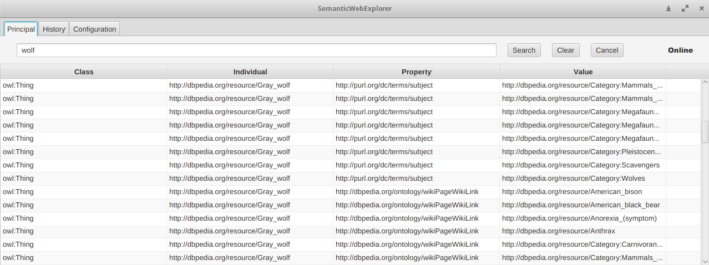
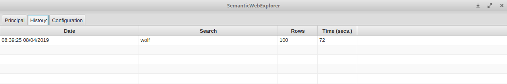
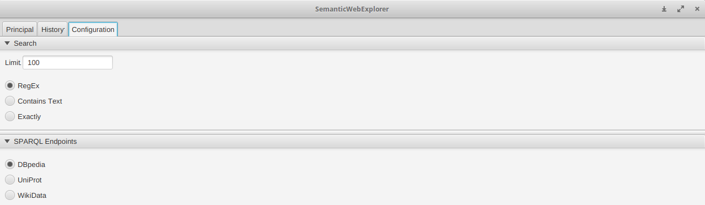

# SemanticWebExplorer

SemanticWebExplorer is an proof of concept designed to query some SPARQL endpoints and infer a local ontology, implemented using JavaFX and SceneBuilder with the MVC pattern in mind. Some queries could delay a lot of time, because the purpose of the implementation is only to test the endpoints, not to make an optimal application.

# Example

### Principal Tab


### History Tab


### Config Tab


# Usage

## Download

```bash

git clone https://github.com/w4tchw0lf/SemanticWebExplorer.git

```

## Execute

```bash

cd app
java -jar SemanticWebExplorer.jar

```

# References
 - [SPARQL](https://www.w3.org/TR/rdf-sparql-query/)
 - [Apache Jena Documentation](https://jena.apache.org/documentation/)
 - [SceneBuilder](https://gluonhq.com/products/scene-builder/)
